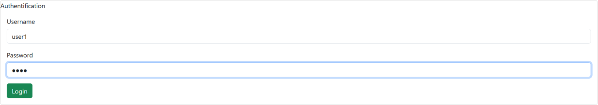
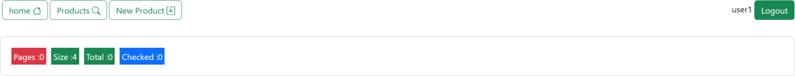
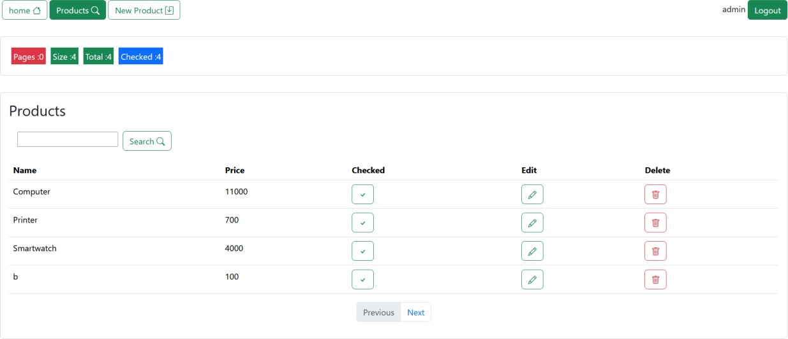
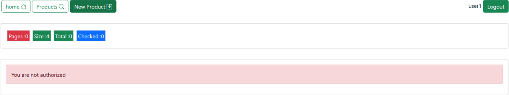
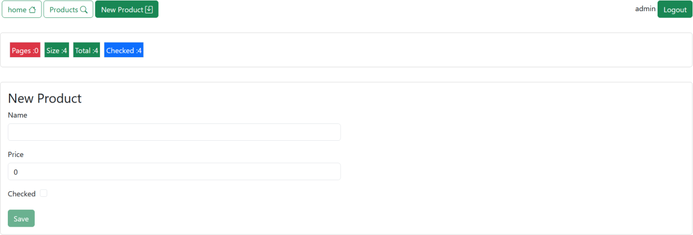

<h1>Angula & Json</h1>
<h2>Captures</h2>

<h3>User</h3>
<h4>la première capture d'écran montre la page de connexion, où l'utilisateur peut se connecter en utilisant son nom d'utilisateur et son mot de passe.</h4>

<h4>la deuxième capture d'écran montre la page d'accueil, où l'utilisateur peut voir la barre de navigation et le bouton de déconnexion à côté de son nom d'utilisateur.</h4>

<h4>La troisième capture d'écran présente la page des produits, où l'utilisateur peut visualiser l'ensemble des produits disponibles et effectuer une recherche précise à l'aide de la barre de recherche..</h4>

<h4>La quatrième capture d'écran illustre la page d'ajout de produit, où l'utilisateur ne peut ajouter un produit que s'il dispose des privilèges d'administrateur.</h4>

<h3>Admin</h3>
<h4>La dernière capture d'écran démontre que, pour un utilisateur administrateur, le composant d'ajout de produit est accessible, lui permettant ainsi d'ajouter un produit à la liste des produits.</h4>

# TotaldemoApp
Ce projet a été généré avec [Angular CLI](https://github.com/angular/angular-cli) version 16.2.9.

# Serveur de développement
Exécutez ng serve pour lancer un serveur de développement. Accédez à l'adresse `http://localhost:4200/.` L'application se rechargera automatiquement si vous modifiez un des fichiers sources.

# Génération de code
Exécutez ng generate component nom-du-composant pour générer un nouveau composant. Vous pouvez également utiliser ng generate directive|pipe|service|class|guard|interface|enum|module.

# Compilation
Exécutez ng build pour compiler le projet. Les artefacts de la compilation seront stockés dans le répertoire dist/.

# Exécution des tests unitaires
Exécutez ng test pour exécuter les tests unitaires via Karma.

# Exécution des tests de bout en bout 
Exécutez ng e2e pour exécuter les tests de bout en bout via une plateforme de votre choix. Pour utiliser cette commande, vous devez d'abord ajouter un package qui implémente les capacités de tests de bout en bout.

# Pour plus d'aide
Pour obtenir plus d'aide sur Angular CLI, utilisez ng help ou consultez la page Angular CLI Overview and Command Reference.